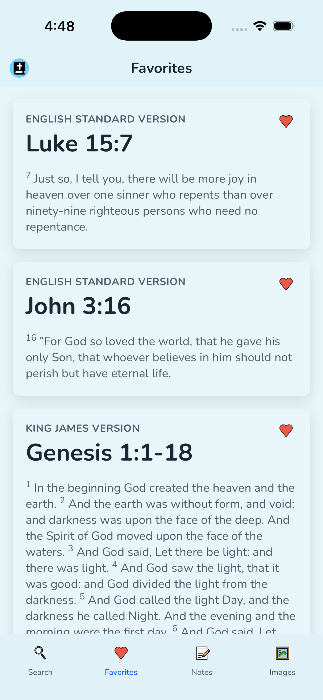
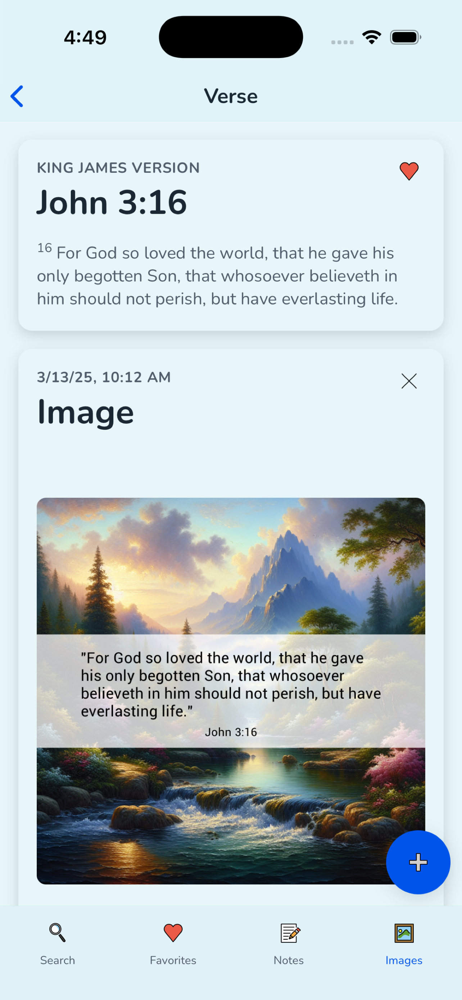
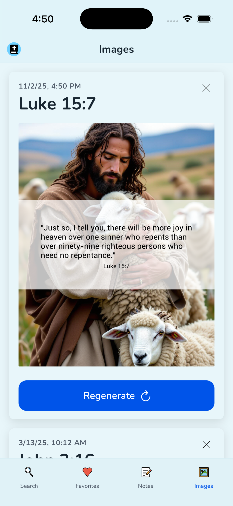

## Hey Bible ✝️

Hey Bible is an easy to use Bible verse lookup tool. With Hey Bible, you can quickly search and favorite verses take notes, and generate beautiful images of your favorite verses.

### Web

You can use Hey Bible on the web at [heybible.app](https://heybible.app).

### Mobile

Hey Bible is available on the [App Store](https://apps.apple.com/us/app/hey-bible/id6474075530) and [Google Play](https://play.google.com/store/apps/details?id=com.workingdevshero.heybible).

     

 

### Support

If you have any questions or feedback, please fill out [this form](https://app.youform.com/forms/o1pfzrgp) and we'll get back to you as soon as possible.
